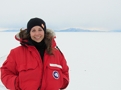

# Caitlin Locke

## Education

- Non-degree, Postbaccalaureate Studies, May 2018 - August 2021, [Columbia University School of Professional Studies](https://sps.columbia.edu/)
- Bachelor of Science, Earth Science, Graduated May 2013, [Columbia University School of General Studies](https://gs.columbia.edu/)

## Research Interests

- Modeling bathymetry beneath ice shelves in the polar regions using airborne geophysics data (primarily gravimetry, lidar, magnetometry, and radar).
- Using airborne and marine geophysical data in combination with ground-based onshore geophysical and geological data to develop new geologic interpretations of the regions beneath ice shelves in Antarctica.
